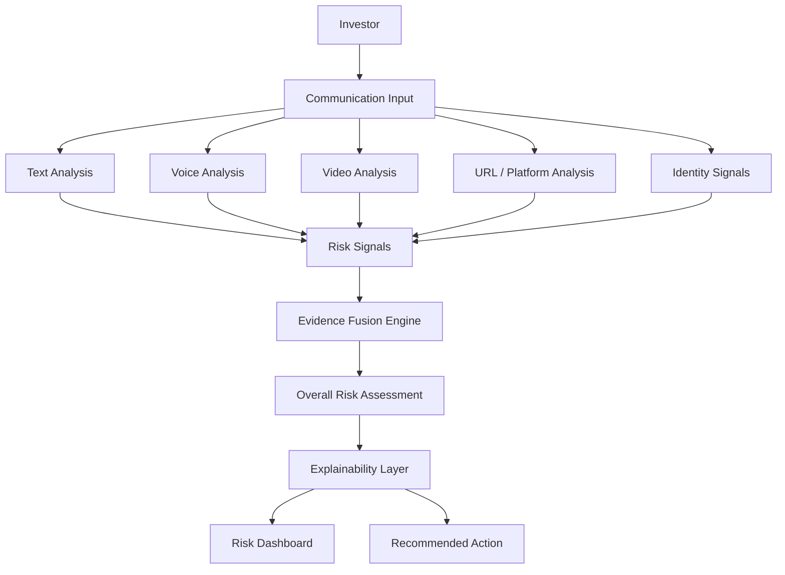
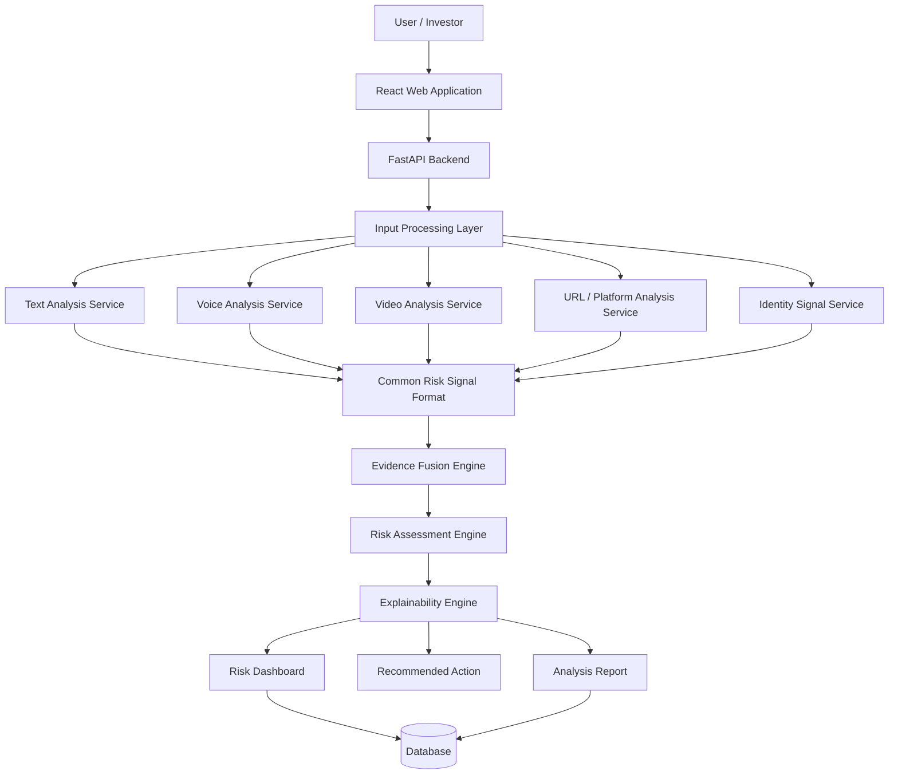
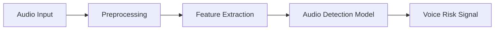
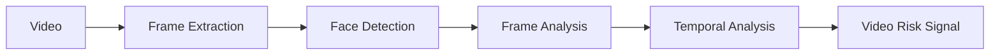
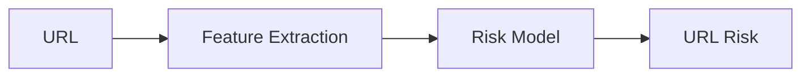
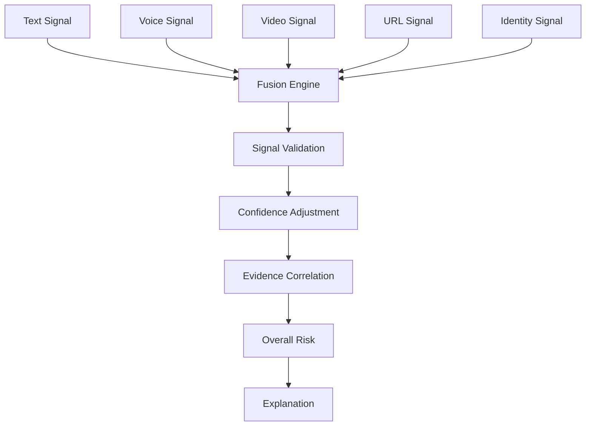
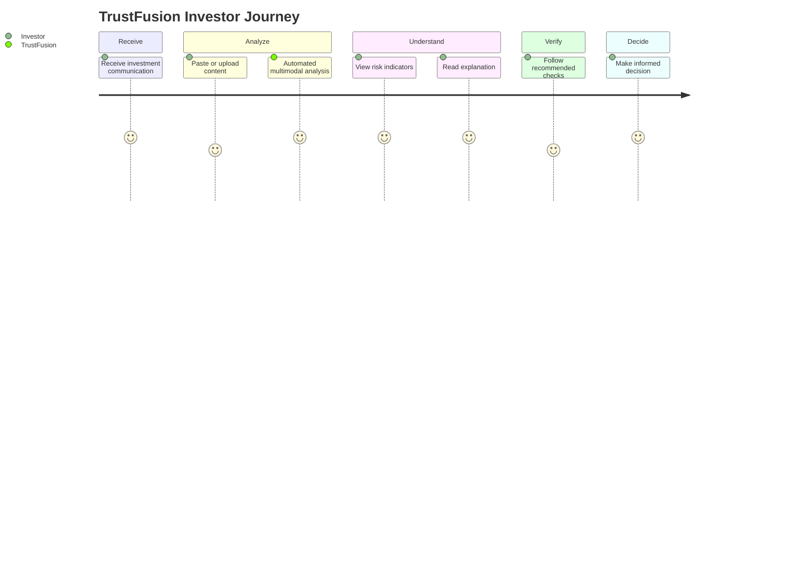
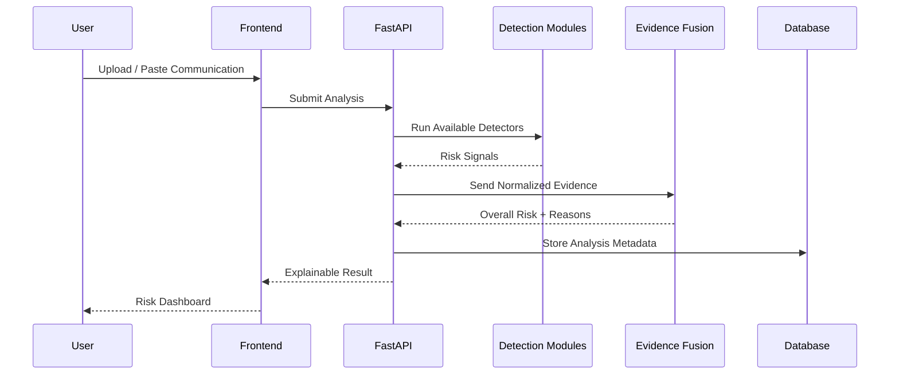
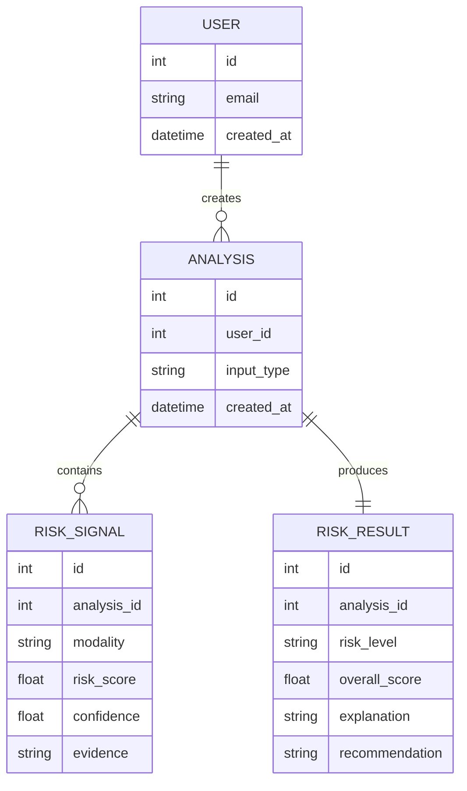
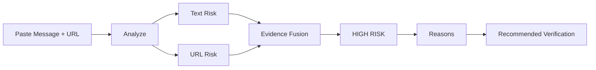

# 🛡️ TrustFusion AI

## Detect. Fuse. Explain. Protect.

### AI-Powered Investment Fraud & Impersonation Risk Detection

> **TrustFusion AI helps retail investors identify suspicious investment communications by combining signals from text, voice, video, URLs/platforms, and identity-related evidence into one explainable risk assessment.**

---


# 1. Overview

**TrustFusion AI** is a multimodal AI-based early-warning and decision-support platform for detecting suspicious investment communications.

Modern investment scams may combine multiple techniques:

- 📝 Social-engineering messages
- 🔗 Fake investment platforms
- 👤 Impersonation
- 🎙️ AI-generated or manipulated voice
- 🎥 Deepfake videos
- ⏰ Urgency and pressure tactics
- 💰 Unrealistic return promises
- 🔐 Requests for sensitive information

A conventional detector may analyze only one signal.

TrustFusion takes a different approach:


The goal is not to legally declare something as fraud.

The goal is to provide an **explainable early warning** so that an investor can verify information before making a potentially irreversible financial decision.

---

# 2. Problem Statement

## AI-Powered Investment Fraud & Impersonation Detection

Retail investors increasingly receive investment recommendations through:

- Messaging applications
- Social media
- Phone calls
- Voice notes
- Videos
- Online trading platforms
- Investment websites

A fraudulent communication may contain several signals simultaneously:

> **Suspicious message + fake investment platform + impersonated advisor + manipulated voice + deepfake video**

The challenge is to detect these signals and help the user understand their combined risk.

### Core Problem

Existing approaches often treat different signals independently.


The investor still has to manually connect and interpret these results.

### TrustFusion Objective

TrustFusion aims to:

1. Detect suspicious signals.
2. Combine evidence from multiple modalities.
3. Generate an overall risk assessment.
4. Explain why the communication appears risky.
5. Recommend practical verification actions.

---

# 3. Problem Understanding

The real user question is not:

> "Is this URL malicious?"

It is not only:

> "Is this video a deepfake?"

The real question is:

> **"Can I trust this investment communication enough to act on it?"**

This requires contextual analysis.

### Example

An investor receives:

> **"Invest ₹50,000 today and get 40% guaranteed returns."**

The user also receives:

- 🎙️ A voice note from a supposed investment expert
- 🎥 A video appearing to show the same expert
- 🔗 A trading platform URL
- 👤 A claimed advisor identity

Individually, each component may not provide enough evidence.

Together, they may create a much stronger warning signal.

---

# 4. Our Solution

## TrustFusion AI

TrustFusion combines specialized analysis modules into one decision-support workflow.

### Core Pipeline



### Core Product Question

TrustFusion answers:

> **WHEN SHOULD I BE CAREFUL, WHY SHOULD I BE CAREFUL, AND WHAT SHOULD I VERIFY?**

---

# 5. Real-World Example

## Scenario

An investor receives:

> **"Invest ₹50,000 today and receive 40% guaranteed returns. Limited-time opportunity. Act now!"**

The communication also contains:

- 🎙️ Voice message
- 🎥 Expert video
- 🔗 Trading platform
- 👤 Claimed financial advisor

### TrustFusion Analysis

| Signal | Example Finding |
|---|---|
| 📝 Text | Guaranteed-return language |
| 📝 Text | Urgency / pressure |
| 🎙️ Voice | Potential synthetic-audio indicators |
| 🎥 Video | Potential manipulation indicators |
| 🔗 Platform | Suspicious URL/domain characteristics |
| 👤 Identity | Verification incomplete |

### Result


```

The system does not simply say:

> "This is definitely a fraud."

Instead, it says:

> **"Multiple suspicious indicators were detected. Verify the investment opportunity before transferring money."**

---

# 6. Key Innovation

## ⭐ Evidence Fusion

Our main innovation is not simply using multiple AI models.

The important part is **connecting their outputs into one contextual assessment**.

### Conventional Approach

```text
Text → Text Result

URL → URL Result

Voice → Voice Result

Video → Video Result
```

The user receives disconnected results.

### TrustFusion Approach

```text
Text Risk
    +
Voice Risk
    +
Video Risk
    +
Platform Risk
    +
Identity Signals
        ↓
EVIDENCE FUSION
        ↓
CONTEXTUAL RISK
        ↓
EXPLANATION
        ↓
ACTION
```

### Why This Matters

One weak signal should not automatically produce a critical warning.

However, several independent suspicious signals occurring together can provide stronger evidence for caution.

### Differentiation

> **TrustFusion is not just another detector. It is a decision-support layer that connects evidence from multiple specialized detectors.**

---

# 7. How TrustFusion Works

## Step 1 — Input

The investor provides one or more:

- Message
- URL
- Audio
- Video
- Claimed identity information

---

## Step 2 — Specialized Analysis

Each input is sent to the appropriate analysis module.

```text
Message → Text Detector

Audio → Voice Detector

Video → Deepfake Detector

URL → Platform Detector

Identity → Verification Signals
```

---

## Step 3 — Signal Normalization

Different models produce different outputs.

TrustFusion converts them into a common format:

```text
Signal Type
Risk Score
Confidence
Evidence
Source
Timestamp
Availability
```

Example:

```json
{
  "signal": "suspicious_return_claim",
  "risk": 0.88,
  "confidence": 0.91,
  "source": "text",
  "evidence": "guaranteed 40% return"
}
```

---

## Step 4 — Evidence Fusion

The normalized signals are combined by the Evidence Fusion Engine.

The engine considers:

- Signal strength
- Model confidence
- Signal type
- Supporting evidence
- Availability of multiple independent signals

---

## Step 5 — Overall Risk

The system generates an overall risk category.

```text
🟢 LOW
🟡 MEDIUM
🟠 HIGH
🔴 CRITICAL
```

The exact thresholds should be calibrated using validation data rather than arbitrarily claiming a probability of fraud.

---

## Step 6 — Explanation

Instead of showing only:

> **Risk = 86**

TrustFusion shows:

```text
🔴 HIGH RISK

Reasons:

• Guaranteed-return language
• Urgency detected
• Suspicious URL characteristics
• Potential voice manipulation
• Potential video manipulation
• Identity verification incomplete
```

---

## Step 7 — Recommended Action

The system provides practical next steps.

Example:

> **Do not transfer money yet. Verify the advisor, organization and payment details through trusted official sources.**

---

# 8. System Architecture



### Architecture Principles

- Modular
- Explainable
- Scalable
- API-driven
- Human-in-the-loop
- Privacy-aware

---

# 9. AI/ML Modules

## 9.1 Text Scam Detection

### Objective

Identify suspicious investment-related language and social-engineering patterns.

### Key Indicators

- Guaranteed returns
- Unrealistic profits
- Urgency
- Fear / pressure
- Payment requests
- Requests for sensitive information
- Authority impersonation
- Limited-time tactics
- Investment pressure

### AI Approach

A transformer-based text classification approach can be used because transformers can capture contextual patterns instead of relying only on individual keywords.

### Possible Technologies

- Hugging Face Transformers
- PyTorch
- Scikit-learn

### Example

```text
"Guaranteed 40% return"
        ↓
Return Promise Indicator

"Invest today"
        ↓
Urgency Indicator

"Send money to this account"
        ↓
Payment Request Indicator
```

---

# 9.2 Voice Analysis

### Objective

Identify potential synthetic or manipulated audio indicators.

### Processing Pipeline



### Potential Features

- Spectral characteristics
- Audio artifacts
- Frequency patterns
- Temporal characteristics
- Synthetic-speech indicators

### Technologies

- Librosa
- PyTorch
- Audio anti-spoofing models

### Output

```text
Voice Risk
+
Confidence
+
Supporting Indicators
```

---

# 9.3 Video / Deepfake Analysis

### Objective

Identify potential manipulation indicators in video.

### Processing Pipeline



### Potential Indicators

- Facial inconsistencies
- Blending artifacts
- Unnatural visual patterns
- Temporal inconsistencies

### Technologies

- OpenCV
- PyTorch
- Suitable pretrained deepfake detection models

### Important

The output is treated as a **risk indicator**, not definitive proof that a video is fake.

---

# 9.4 URL / Platform Analysis

### Objective

Identify suspicious investment platforms and phishing-style URLs.

## Prominent Features

These can be directly observed from the URL:

- URL length
- IP address usage
- HTTPS presence
- Number of subdomains
- Special characters
- `@` symbol
- Suspicious keywords
- URL shortening

## Non-Prominent / Supporting Features

These may require external information:

- Domain age
- WHOIS information
- Website traffic
- SSL details
- Reputation information
- Loading behavior

### Pipeline



### Example

```text
Suspicious URL
      ↓
Feature Extraction
      ↓
ML / Rule Analysis
      ↓
URL Risk
      ↓
Evidence Fusion
```

---

# 9.5 Identity Verification

### Objective

Identify inconsistencies around a claimed investment advisor or organization.

### Possible Signals

- Claimed name
- Organization name
- Trusted reference availability
- Domain/organization consistency
- Contact information consistency
- Public verification information

### Important Limitation

Identity verification is only as reliable as the trusted reference information available.

Therefore:

```text
Reliable Reference Available
        ↓
Verification Possible

No Reliable Reference
        ↓
Identity = UNKNOWN / UNVERIFIED
```

TrustFusion should never falsely claim that an identity is verified without reliable evidence.

---

# 10. Evidence Fusion Engine

The Evidence Fusion Engine is the central intelligence layer.

### Inputs

```text
Text Risk
Voice Risk
Video Risk
URL Risk
Identity Risk
```

Each signal can contain:

```text
Risk Score
Confidence
Evidence
Source
Availability
```

### Architecture



### Important Design Principle

TrustFusion should **not simply average all model outputs**.

A production implementation should consider:

- Confidence
- Signal reliability
- Missing modalities
- Correlated evidence
- Contradictory evidence
- Calibration

---

# 11. Risk Assessment

TrustFusion can categorize results into:

| Risk Level | Meaning |
|---|---|
| 🟢 **Low** | Few or weak suspicious indicators |
| 🟡 **Medium** | Some meaningful risk indicators |
| 🟠 **High** | Multiple strong risk indicators |
| 🔴 **Critical** | Strong combined evidence requiring immediate caution |

### Example

```text
TEXT       → HIGH
VOICE      → MEDIUM
VIDEO      → HIGH
PLATFORM   → HIGH
IDENTITY   → MEDIUM
              ↓
        EVIDENCE FUSION
              ↓
          🔴 HIGH RISK
```

### Important

The risk category is a **decision-support indicator**, not a legal determination of fraud.

---

# 12. Explainability

TrustFusion is designed around **explainable risk assessment**.

Instead of:

```text
Risk = 87
```

the user receives:

```text
🔴 HIGH RISK

Key Indicators:

1. Guaranteed-return claim
2. Urgency detected
3. Suspicious URL characteristics
4. Potential voice manipulation
5. Potential video manipulation
6. Identity not independently verified
```

### Explainability Goals

- Show important evidence.
- Identify the source of each signal.
- Show confidence where appropriate.
- Distinguish detected indicators from verified facts.
- Give practical verification actions.

### Example

```text
WHY IS THIS RISKY?

📝 Text
Guaranteed return + urgency

🔗 Platform
Suspicious URL characteristics

🎙️ Voice
Potential synthetic-audio indicators

🎥 Video
Potential manipulation indicators

👤 Identity
Not independently verified
```

---

# 13. User Workflow



### Simple User Journey

```text
RECEIVE
   ↓
UPLOAD / PASTE
   ↓
ANALYZE
   ↓
UNDERSTAND RISK
   ↓
VERIFY
   ↓
DECIDE
```

---

# 14. Prototype / MVP

## Hackathon MVP

The MVP prioritizes the most demonstrable and feasible components.

### Core MVP

- 📝 Text scam analysis
- 🔗 URL / platform analysis
- 🧠 Evidence Fusion
- 📊 Risk scoring
- 💡 Explainable dashboard
- 🛡️ Recommended actions

### Additional Modules

- 🎙️ Voice analysis
- 🎥 Video/deepfake analysis
- 👤 Identity verification

These modules can be integrated progressively.

### MVP Principle

> **A working core is more valuable than an unfinished collection of features.**

### Prototype Architecture

```text
Text + URL
    ↓
Detection Modules
    ↓
Evidence Fusion
    ↓
Risk Assessment
    ↓
Explanation
    ↓
Action
```

---

# 15. Technology Stack

| Layer | Technologies |
|---|---|
| Frontend | React |
| UI | Tailwind CSS |
| Charts | Recharts / Chart.js |
| Backend | Python, FastAPI |
| ML | PyTorch, Scikit-learn |
| NLP | Hugging Face Transformers |
| Video | OpenCV |
| Audio | Librosa |
| Database | PostgreSQL |
| MVP Database | SQLite |
| Containerization | Docker |
| Deployment | Cloud |

### Why This Stack?

- React provides a responsive interactive interface.
- FastAPI enables lightweight and fast ML APIs.
- PyTorch supports deep-learning models.
- Hugging Face provides pretrained NLP models.
- OpenCV handles video processing.
- Librosa supports audio processing.
- PostgreSQL provides scalable storage.
- Docker simplifies deployment.

---

# 16. Data Requirements

TrustFusion requires different data for different modalities.

## Text Data

Potential data:

- Investment scam messages
- Phishing/social-engineering messages
- Legitimate investment communications

Possible labels:

```text
SCAM
LEGITIMATE
SUSPICIOUS
```

---

## URL Data

Potential data:

- Phishing URLs
- Malicious URLs
- Legitimate URLs
- Domain features

---

## Audio Data

Potential data:

- Real human speech
- Synthetic speech
- Spoofed speech
- Manipulated audio

---

## Video Data

Potential data:

- Real videos
- Deepfake videos
- Manipulated videos

---

## Identity Data

Potential data:

- Verified organizations
- Trusted domain information
- Authoritative public references

---

# 17. Model Strategy

We follow a:

> **Specialized Model + Evidence Fusion Architecture**

```text
SPECIALIZED MODELS
       ↓
RISK SIGNALS
       ↓
STANDARDIZED FORMAT
       ↓
EVIDENCE FUSION
       ↓
EXPLAINABLE DECISION SUPPORT
```

### Why This Architecture?

Training one large model for every modality would be unnecessarily complex for a hackathon.

Instead:

- Use specialized models for specialized tasks.
- Normalize their outputs.
- Combine the evidence.
- Focus our engineering effort on fusion and explainability.

### Benefits

- Easier to develop
- Easier to test
- Easier to replace individual models
- More explainable
- More scalable
- More practical for a hackathon

---

# 18. Open-Source Repository Strategy

Existing open-source repositories can be used as **references or components** where their licenses and implementation quality permit.

## 🥇 1. SpoorthyM-2024/phishing-detection-system

### Useful For

**URL / Platform Analysis**

It can serve as a reference for:

- URL feature extraction
- Phishing detection workflow
- ML-based URL classification
- Backend/detection structure

### TrustFusion Integration

```text
Repository Reference
       ↓
URL Feature Extraction
       ↓
URL Risk
       ↓
Evidence Fusion
```

---

## 🥈 2. kashishhMehra/phishing-url-detection

### Useful For

**Explainable URL Risk Analysis**

It can provide a reference for:

- URL feature analysis
- Phishing classification
- Suspicious-feature identification
- Explanation-oriented outputs

### TrustFusion Integration

```text
URL
 ↓
Feature Analysis
 ↓
Suspicious Indicators
 ↓
URL Risk
 ↓
Evidence Fusion
```

---

## 🥉 3. mlvanguards/fraud-audio-detection

### Useful For

**Voice / Audio Analysis**

It can serve as a starting reference for:

- Audio preprocessing
- Feature extraction
- Fraud/synthetic audio detection
- Model inference workflow

### TrustFusion Integration

```text
Audio
 ↓
Preprocessing
 ↓
Audio Model
 ↓
Voice Risk
 ↓
Evidence Fusion
```

---

## 4️⃣ ishal1410/deepfake-detection-faceforensics

### Useful For

**Video / Deepfake Analysis**

It can serve as a reference for:

- Video processing
- Frame extraction
- Face analysis
- Deepfake detection workflow

### TrustFusion Integration

```text
Video
 ↓
Frame Extraction
 ↓
Deepfake Analysis
 ↓
Video Risk
 ↓
Evidence Fusion
```

---

## ⚠️ Important Open-Source Rule

These repositories are **not the complete TrustFusion solution**.

Our contribution is the integration layer:

```text
Existing Detection Components
          ↓
Standardized Risk Signals
          ↓
TrustFusion Evidence Fusion
          ↓
Explainability
          ↓
Investor Decision Workflow
```

Before using any repository in production, review:

- License
- Dependencies
- Dataset restrictions
- Security
- Model limitations
- Compatibility
- Maintenance status

---

# 19. API Architecture

Example backend endpoints:

```text
POST /api/analyze/text
POST /api/analyze/url
POST /api/analyze/audio
POST /api/analyze/video
POST /api/analyze/identity

POST /api/fusion/analyze

GET /api/analysis/{id}

GET /api/health
```

### API Workflow



---

# 20. Database Design

A possible MVP database structure:



### Example Analysis Record

```json
{
  "analysis_id": 101,
  "risk_level": "HIGH",
  "overall_score": 0.86,
  "signals": [
    {
      "modality": "text",
      "risk_score": 0.88
    },
    {
      "modality": "url",
      "risk_score": 0.91
    }
  ],
  "recommendation": "Verify before transferring money."
}
```

---

# 21. Security & Privacy

Investment-related information can be highly sensitive.

TrustFusion follows **privacy-by-design principles**.

### Security Measures

- HTTPS
- Secure API authentication
- Input validation
- Access control
- Encryption for sensitive data
- Secure file handling
- Rate limiting
- Malware-safe file processing
- Minimal data retention

### Privacy Principle

> **Collect only the data necessary for analysis.**

For the MVP, uploaded media should preferably be processed temporarily unless permanent storage is explicitly required.

### Sensitive Data

Users should not be encouraged to upload:

- Passwords
- OTPs
- Bank credentials
- Credit/debit card information
- Private keys
- Unnecessary personal documents

---

# 22. Responsible AI

TrustFusion does **not** claim to legally determine fraud.

## We do NOT claim:

- ❌ 100% accuracy
- ❌ Guaranteed fraud detection
- ❌ Guaranteed deepfake detection
- ❌ Definitive identity verification without trusted evidence
- ❌ Guaranteed financial safety

## We provide:

- ✅ Risk indicators
- ✅ Supporting evidence
- ✅ Confidence information
- ✅ Explainable reasoning
- ✅ Recommended verification steps

### Core Principle

> **AI warns and explains; the user makes the final financial decision.**

---

# 23. Limitations

## 1. False Positives

Legitimate investment communications may sometimes appear suspicious.

### Mitigation

Use multiple signals and communicate uncertainty.

---

## 2. False Negatives

New scam techniques may bypass existing models.

### Mitigation

Continuous evaluation and model updating.

---

## 3. Deepfake Evolution

Attackers continuously develop new manipulation techniques.

### Mitigation

Evaluate models against updated datasets.

---

## 4. Data Quality

Poor audio/video quality can affect detection.

### Mitigation

Use input-quality checks and confidence-aware results.

---

## 5. Identity Verification

Identity claims cannot be verified without reliable reference information.

### Mitigation

Clearly distinguish:

```text
VERIFIED
UNVERIFIED
INCONSISTENT
UNKNOWN
```

---

## 6. Model Bias

A model trained on limited datasets may perform differently on unseen examples.

### Mitigation

Use diverse datasets and report performance across relevant categories.

---

# 24. Evaluation & KPIs

## AI Metrics

Each detection module should be evaluated using appropriate metrics:

- Precision
- Recall
- F1-score
- ROC-AUC where appropriate
- False-positive rate
- False-negative rate
- Inference time

---

## Product Metrics

We can measure:

- Average analysis time
- Explanation coverage
- Number of supported modalities
- User understanding
- False-alert rate
- Successful verification actions

---

## System Metrics

- API response time
- Model latency
- Failure rate
- Concurrent analysis capacity
- Resource utilization

### Important Principle

> **We will report measured results instead of inventing accuracy numbers.**

---

# 25. Business Model

TrustFusion can evolve into a **B2C + B2B product**.

## B2C — Freemium

### Free Tier

- Basic URL analysis
- Basic text analysis
- Limited daily checks

### Premium Tier

- Multimodal analysis
- Detailed reports
- Advanced alerts
- Analysis history
- Extended verification tools

---

## B2B

Potential customers:

- Banks
- Fintech companies
- Brokers
- Investment platforms
- Cybersecurity organizations
- Fraud-prevention teams

### B2B Model

```text
TrustFusion API
      ↓
Financial Platform
      ↓
Communication Analysis
      ↓
Risk Signal
      ↓
Platform Decision Workflow
```

### Revenue Possibilities

- API usage
- Enterprise licensing
- Subscription
- Custom integrations
- Risk intelligence services

---

# 26. Target Users

## 🎯 Primary Users

### Retail Investors

People receiving:

- Investment recommendations
- Trading links
- Advisor messages
- Investment videos
- Voice messages
- Social-media investment offers

---

## 🏦 Secondary Users

### Financial Organizations

- Banks
- Brokers
- Fintech companies
- Investment platforms

---

## 🛡️ Tertiary Users

### Fraud / Security Teams

Organizations investigating:

- Suspicious campaigns
- Investment scams
- Impersonation
- Malicious platforms
- Coordinated fraud attempts

---

# 27. Competitive Differentiation

| Capability | Single-Modality Tools | TrustFusion AI |
|---|---:|---:|
| Text analysis | ✅ | ✅ |
| URL analysis | ✅ | ✅ |
| Voice analysis | Some | ✅ |
| Video analysis | Some | ✅ |
| Identity signals | Limited | ✅ |
| Evidence fusion | Limited | ⭐ Core |
| Explainable result | Varies | ⭐ Core |
| Recommended action | Limited | ✅ |
| Investor-focused workflow | Limited | ⭐ Core |
| Multimodal context | Limited | ⭐ Core |

### Our Positioning

> **We are not trying to replace every existing fraud detector. We are building the decision layer that connects their evidence.**

### Core Differentiator

```text
DETECTION
    +
CONTEXT
    +
EVIDENCE FUSION
    +
EXPLAINABILITY
    =
BETTER DECISION SUPPORT
```

---

# 28. Scalability

TrustFusion is designed as a modular architecture.

## Current MVP

```text
Text
  +
URL
  ↓
Evidence Fusion
  ↓
Risk Assessment
```

## Extended System

```text
Text
URL
Voice
Video
Identity
Behavior
External Intelligence
      ↓
Evidence Fusion
      ↓
Risk Intelligence Platform
```

### Scaling Strategy

- Microservices
- Docker containers
- Asynchronous processing
- Model serving
- Cloud deployment
- API gateway
- Caching
- Queue-based media processing
- Horizontal scaling

### Modular Advantage

If a better voice or video model becomes available, we can replace that detector without rebuilding the entire platform.

---

# 29. Future Scope

## Phase 1 — Hackathon MVP

```text
Text + URL
     ↓
Evidence Fusion
     ↓
Explainable Risk Dashboard
```

---

## Phase 2 — Multimodal Expansion

```text
+ Voice
+ Video
+ Identity
```

---

## Phase 3 — Consumer Platform

```text
Browser Extension
        +
Mobile Application
        +
Real-Time Alerts
```

---

## Phase 4 — Enterprise Intelligence

```text
Scam Campaign Detection
        +
Trusted Financial Integrations
        +
Enterprise Fraud Intelligence
```

---

## Long-Term Vision

> **Build a digital safety layer that helps investors evaluate suspicious investment communications before financial harm occurs.**

---

# 30. Project Structure

```text
trustfusion-ai/
│
├── frontend/
│   ├── src/
│   ├── components/
│   ├── pages/
│   └── services/
│
├── backend/
│   ├── main.py
│   ├── api/
│   ├── services/
│   ├── models/
│   ├── fusion/
│   └── utils/
│
├── ml/
│   ├── text/
│   ├── url/
│   ├── audio/
│   ├── video/
│   └── identity/
│
├── data/
│   ├── raw/
│   ├── processed/
│   └── README.md
│
├── notebooks/
│
├── tests/
│
├── docs/
│
├── docker/
│
├── requirements.txt
├── docker-compose.yml
├── .env.example
├── LICENSE
└── README.md
```

---

# 31. Installation

## Prerequisites

Make sure the following are installed:

- Python 3.10+
- Node.js 18+
- npm
- Git
- Docker (optional)

---

## Clone Repository

```bash
git clone <YOUR_REPOSITORY_URL>
cd trustfusion-ai
```

---

## Backend Setup

Create virtual environment:

```bash
python -m venv venv
```

### Windows

```bash
venv\Scripts\activate
```

### Linux / macOS

```bash
source venv/bin/activate
```

Install dependencies:

```bash
pip install -r requirements.txt
```

---

## Frontend Setup

```bash
cd frontend
npm install
```

---

# 32. Running the Project

## Start Backend

From the project root:

```bash
uvicorn backend.main:app --reload
```

Backend:

```text
http://localhost:8000
```

---

## Start Frontend

```bash
cd frontend
npm run dev
```

Frontend:

```text
http://localhost:5173
```

---

## API Documentation

FastAPI automatically provides interactive API documentation at:

```text
http://localhost:8000/docs
```

---

## Docker

If Docker configuration is available:

```bash
docker-compose up --build
```

---

# 33. Demo Scenario

## Demo Input

### Suspicious Message

```text
Invest ₹50,000 today and receive 40% guaranteed returns.
Act now because this opportunity expires today.
```

### URL

```text
https://example-suspicious-investment-site.com
```

### Additional Media

- Suspicious voice note
- Claimed expert video

---

## Demo Flow



---

## Expected Dashboard

```text
╔══════════════════════════════════════╗
║       TRUSTFUSION AI ANALYSIS        ║
╠══════════════════════════════════════╣
║                                      ║
║ 🔴 HIGH RISK                         ║
║                                      ║
║ Text Risk       HIGH                 ║
║ URL Risk        HIGH                 ║
║ Voice Risk      MEDIUM               ║
║ Video Risk      HIGH                 ║
║ Identity        UNVERIFIED           ║
║                                      ║
║ WHY?                                 ║
║ • Guaranteed return claim            ║
║ • Urgency detected                   ║
║ • Suspicious platform indicators     ║
║ • Media manipulation indicators      ║
║                                      ║
║ ACTION                               ║
║ Verify before transferring money.    ║
╚══════════════════════════════════════╝
```

### Important Demo Rule

Only demonstrate modules that are actually implemented and working.

Do not claim that a model is operational if it is only planned.

---

# 34. Team Contribution

Suggested team division:

## 👩‍💻 Member 1 — AI / NLP

Responsibilities:

- Text scam detection
- NLP preprocessing
- Text model evaluation
- Text risk indicators

---

## 👨‍💻 Member 2 — URL / Platform

Responsibilities:

- URL feature extraction
- Phishing detection
- Platform risk analysis
- URL model evaluation

---

## 🎙️ Member 3 — Audio / Video

Responsibilities:

- Audio preprocessing
- Voice detection
- Video preprocessing
- Deepfake analysis

---

## ⚙️ Member 4 — Backend / Fusion

Responsibilities:

- FastAPI
- Evidence Fusion Engine
- Risk scoring
- Database
- API integration

---

## 🎨 Member 5 — Frontend / Product

Responsibilities:

- React dashboard
- Risk visualization
- UI/UX
- User workflow
- Explainability interface

---

# 35. Project Philosophy & Final Value Proposition

## 🧠 Project Philosophy

TrustFusion is built around five principles:

```text
DETECT
   ↓
Find suspicious signals

FUSE
   ↓
Connect independent evidence

EXPLAIN
   ↓
Show why the communication is risky

VERIFY
   ↓
Guide the user toward trusted checks

PROTECT
   ↓
Help prevent avoidable financial loss
```

---

# 🎯 Final Value Proposition

## The Problem

> Investment scams are becoming multimodal and increasingly convincing.

## The Conventional Approach

> Detect individual suspicious components separately.

## Our Approach

> **Fuse multiple signals from the same communication into one explainable risk assessment.**

## The User Gets

```text
WHAT IS RISKY?
       +
WHY IS IT RISKY?
       +
WHAT SHOULD I VERIFY?
```

---

# 🚀 Why TrustFusion AI?

### 1. Multimodal

Analyzes multiple types of investment communication.

### 2. Explainable

Shows the evidence behind the warning.

### 3. Practical

Designed around the investor's actual decision.

### 4. Modular

Individual detection models can be independently upgraded.

### 5. Scalable

Can evolve from a hackathon MVP into an API-driven platform.

### 6. Responsible

Does not claim perfect accuracy or legally determine fraud.

---

# 🏆 Core USP

> ## **"Don't just detect one suspicious signal. Fuse the evidence and explain the risk."**

---

# 🔐 Responsible Use

TrustFusion AI is intended to support safer decision-making.

It should not be used as the sole basis for:

- Investment decisions
- Legal conclusions
- Identity confirmation
- Fraud prosecution
- Financial guarantees

Users should independently verify investment opportunities, organizations, advisors and payment details through trusted official sources.

---

# ⚠️ Disclaimer

TrustFusion AI is a prototype for educational, research and hackathon purposes.

The system provides **risk indicators and decision support**, not legal or financial advice.

A high-risk result does not legally prove fraud, and a low-risk result does not guarantee that an investment or communication is safe.

Users should independently verify investment opportunities, organizations, advisors and payment details through trusted official sources before making financial decisions.

---

# 🛡️ TRUSTFUSION AI

## Detect. Fuse. Explain. Protect.

> ### **Before you trust an investment communication, verify the evidence behind it.**

---

## ⭐ Built for Safer Digital Investment Decisions

```text
                 TRUSTFUSION AI
                       │
          ┌────────────┼────────────┐
          ↓            ↓            ↓
       DETECT        FUSE        EXPLAIN
          │            │            │
          └────────────┼────────────┘
                       ↓
                  PROTECT
```

**TrustFusion AI — turning fragmented scam signals into explainable risk intelligence.**
