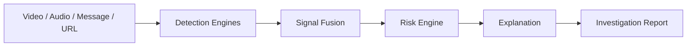

# 🛡️ FroudFuse AI

### **AI-Based Investor Fraud & Impersonation Detection**

> **Detect suspicious signals. Explain the risk. Protect the investor.**

InvestorShield is an AI-powered **FinTech and cybersecurity platform** that analyzes suspicious investment **videos, audio, messages, and trading-platform URLs** to identify potential fraud and impersonation.

It combines multimodal AI, rule-based detection, platform intelligence, and explainable risk scoring to help investors make safer decisions.

> ⚠️ **InvestorShield is a screening and decision-support system, not a legal fraud determination.**

---

## 🚨 Problem

Investors are increasingly targeted through:

* 🎭 Fake financial advisors and celebrity impersonation
* 🎥 Deepfake investment videos
* 💬 Fraudulent WhatsApp/Telegram messages
* 💰 Guaranteed-return and urgency-based scams
* 🌐 Fake trading platforms and suspicious URLs
* 💳 Requests for direct payments or transfers

Traditional tools often analyze only one type of signal. InvestorShield combines **multiple signals into one explainable risk assessment**.

---

## 💡 Our Solution

InvestorShield follows a multimodal detection pipeline:



### 🔍 Detection Capabilities

| Module      | Detection                              |
| ----------- | -------------------------------------- |
| 🎥 Media    | Deepfake and suspicious-frame analysis |
| 🎙️ Audio   | Audio extraction + Speech-to-Text      |
| 💬 Text     | Regex + NLP fraud-language detection   |
| 🎭 Identity | Potential impersonation detection      |
| 🔗 Platform | URL and trading-platform risk analysis |

---

## ⚖️ Explainable Risk Engine

All signals are normalized and combined into a **0–100 risk score**.

| Signal            | Weight |
| ----------------- | -----: |
| 🎥 Deepfake       |    25% |
| 🎙️ Audio         |    10% |
| 🚨 Fraud Language |    25% |
| 🎭 Impersonation  |    20% |
| 🌐 Platform       |    20% |

### Risk Levels

* 🟢 **0–30:** LOW
* 🟡 **31–60:** MEDIUM
* 🟠 **61–80:** HIGH
* 🔴 **81–100:** CRITICAL

The system preserves **component scores, evidence, and reasons** so users can understand *why* a case was flagged.

---

## 🏗️ System Architecture


```


## 🛠️ Technology Stack

| Layer                     | Technology                                  |
| ------------------------- | ------------------------------------------- |
| 🎨 Frontend               | React + TypeScript + Vite + Tailwind        |
| ⚡ Backend                 | Python + FastAPI                            |
| 🤖 ML                     | Python + OpenCV + Pretrained Deepfake Model |
| 🎙️ Audio                 | FFmpeg + Speech-to-Text                     |
| 📝 Text                   | Regex + NLP                                 |
| 🌐 Platform               | TRIP/API Adapter + Local URL Checks         |
| 🗄️ Database/Auth/Storage | Supabase                                    |
| 🧠 AI Orchestration       | MCP                                         |
| 🔧 Version Control        | Git + GitHub                                |

---

## 🖥️ Key Features

* 📤 Multimodal investigation input
* 🎥 Deepfake detection
* 💬 Fraud-language detection
* 🎭 Impersonation analysis
* 🔗 Suspicious platform/URL detection
* 📊 Explainable risk scoring
* 🔎 Evidence and detection breakdown
* 📈 Investigation dashboard
* 📄 Automated investigation report
* 🛟 Fallback mechanisms for API/ML failures

---

## 🔄 Demo Workflow

```text
Suspicious Investment Video / Message
                ↓
       Multimodal Detection
                ↓
          Signal Fusion
                ↓
          Risk Calculation
                ↓
       🔴 91/100 — CRITICAL
                ↓
      Evidence + Explanation
                ↓
       Investigation Report
```

---

## 🛡️ Reliability & Fallbacks

InvestorShield is designed to keep the demo functional even when individual components fail.

| Failure            | Fallback                |
| ------------------ | ----------------------- |
| 🤖 ML failure      | Precomputed/demo result |
| 🌐 API failure     | Local URL analysis      |
| 🧠 MCP failure     | Normal REST API flow    |
| 📡 Network failure | Local demo case         |

> **Golden Rule: The main end-to-end demo must remain functional.**

---

## 🎯 Success Criteria

InvestorShield is demo-ready when:

* ✅ End-to-end analysis works
* ✅ Video/text analysis produces results
* ✅ Risk score is calculated correctly
* ✅ Evidence is displayed
* ✅ Explanation is generated
* ✅ Data is stored in Supabase
* ✅ Dashboard displays the investigation
* ✅ Report can be generated
* ✅ At least one fallback works

---

## 🚀 Development Principle

> **BUILD LESS. INTEGRATE EARLY. KEEP THE MAIN DEMO WORKING.**

The system prioritizes a functional end-to-end investigation pipeline over unnecessary features or complexity.

---

## 🏆 Vision

InvestorShield aims to give investors a **single intelligent layer of protection** against modern investment scams by combining:

**Multimodal AI + Fraud Detection + Impersonation Analysis + Platform Intelligence + Explainable Risk Scoring**

### 🛡️ InvestorShield

**Detect suspicious signals. Explain the risk. Protect the investor.**
